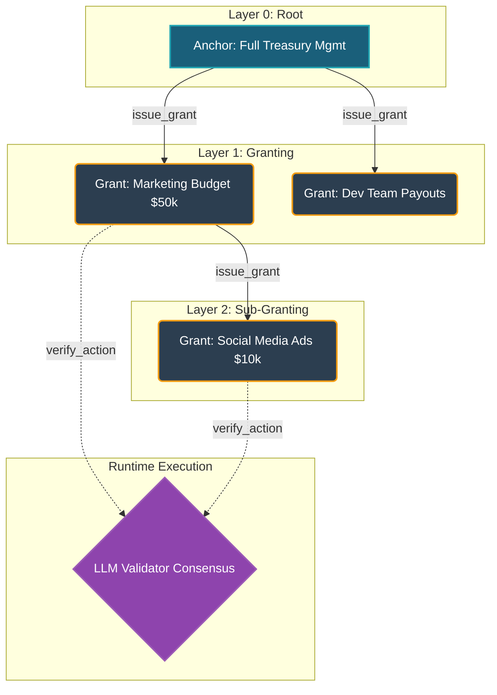

# Fiske: Intelligent Semantic Permission Graph 🧠🔗

[](https://studio.genlayer.com)
[](https://python.org)
[](https://opensource.org/licenses/MIT)

**Fiske** is a sophisticated, decentralized access control protocol built natively for the GenLayer network. By abstracting static Role-Based Access Control (RBAC) into dynamic, semantically evaluated natural language constraints, Fiske introduces a **Hierarchical Permission Graph** mediated by Large Language Model (LLM) consensus.

---

## 🚀 Deployed Contract (Studio Network)
- **Contract Address**: [`0x5E2C64CF7969DAC7b7649f3f8A17f11019Ee3529`](https://explorer-studio.genlayer.com/address/0x5E2C64CF7969DAC7b7649f3f8A17f11019Ee3529)
- **Explorer**: [View on GenLayer Studio Explorer](https://explorer-studio.genlayer.com/address/0x5E2C64CF7969DAC7b7649f3f8A17f11019Ee3529)

---

## 📖 Table of Contents
1. [Abstract](#abstract)
2. [System Architecture](#system-architecture)
3. [The Equivalence Principle](#the-equivalence-principle)
4. [Documentation](#documentation)
5. [Local Development & Testing](#local-development--testing)
6. [License](#license)

---

## 🔬 Abstract

Traditional smart contracts rely on rigid cryptographic signatures and hardcoded boolean flags (e.g., `hasRole(MINTER_ROLE)`). Fiske transcends this limitation by allowing principals to define access boundaries in natural language. 

Through GenLayer's non-deterministic Execution Environment, Fiske establishes **Anchors** (root authorities) and evaluates **Grants** (granted permissions) at runtime. The network's consensus mechanism acts as a semantic compiler, guaranteeing that downstream actions are strictly subset-contained by their upstream cryptographic constraints.

---

## 🏛 System Architecture

Fiske models permissions as a Directed Acyclic Graph (DAG) with strict depth constraints.



**Key Components:**
- **Anchors**: The cryptographic genesis of authority. Created by EOAs, establishing the absolute boundary of a permission namespace.
- **Grants**: Assigned subset authorities. A Grant can branch up to `LIMIT_DEPTH = 5` times, provided `can_branch` is asserted.
- **Cascading Revocation**: State health is evaluated lazily. If an upstream `Anchor` or intermediate `Grant` is revoked or expires, the entire downstream subgraph collapses to `STATE_BROKEN_CHAIN`.

---

## ⚖️ The Equivalence Principle

Fiske enforces security via the **Equivalence Principle**. During `verify_action` or `issue_grant`, the GenVM LLM acts as an isolated sandbox evaluating semantic subsets. 

Let $S_{up}$ be the upstream scope and $S_{down}$ be the requested downstream scope or action. The consensus matrix $\mathcal{C}$ evaluates:
$$\mathcal{C}(S_{up}, S_{down}) \in \{\text{CONTAINED}, \text{NOT\_CONTAINED}, \text{UNRESOLVED}\}$$

The transaction only commits to the deterministic state trie if a Byzantine majority of validators agree that $S_{down} \subseteq S_{up}$.

---

## 📚 Documentation

For a comprehensive technical deep dive into Fiske's internals, refer to the `docs/` directory:

- [**Architecture & State Machine**](./docs/architecture.md): Deep dive into data structures, Merkle-hashing for IDs, and state health evaluation.
- [**API Reference**](./docs/api_reference.md): Complete typed interface for all public writes and views.
- [**Consensus & Prompt Engineering**](./docs/consensus_model.md): How Fiske defends against prompt injection and handles non-deterministic equivalence.

---

## 🛠 Local Development & Testing

Fiske ships with a fully mocked, high-fidelity GenVM testing environment. The `conftest.py` harness simulates the LLM consensus layer, storage access (`TreeMap`), and transaction state.

### Requirements
- Python 3.10+
- `pytest`

### Running the Test Suite
Clone the repository and run the test harness:
```bash
git clone https://github.com/Chimdi-hash/fiske.git
cd fiske
python -m pytest tests/
```

### Expected Output
```text
============================= test session starts =============================
platform win32 -- Python 3.14.5, pytest-9.0.3, pluggy-1.6.0
rootdir: C:\Python_projects\fiske.py
plugins: genlayer-test-0.29.2
collected 5 items

tests\test_fiske.py .....                                                [100%]

============================== 5 passed in 0.25s ==============================
```

---

## 📄 License

This project is licensed under the MIT License - see the LICENSE file for details.
